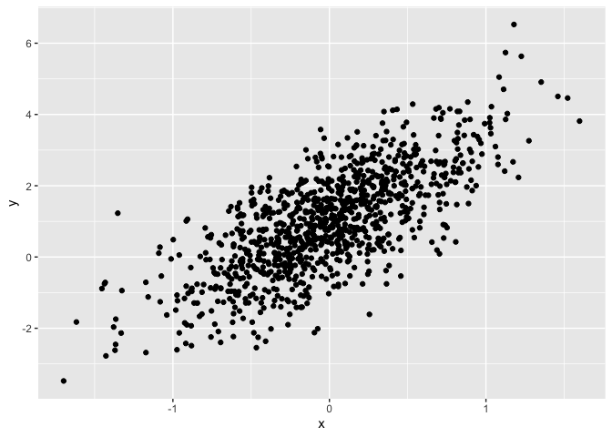

Simple document
================
Philip Kim
2021-09-16

## timestamp for html stuff: (55:00)

I’m an R Markdown document!

# Section 1

Here’s a **code chunk** that samples from a *normal distribution*:

``` r
samp = rnorm(100)
length(samp)
```

    ## [1] 100

# Section 2

I can take the mean of the sample, too! The mean is 0.0261228.

# Section 3

Let’s write a new code chunk.

This code chunk imports the `tidyverse`, creates a data frame, and makes
a histogram.

``` r
library(tidyverse)
set.seed(1234)

plot_df = tibble(
  x = rnorm(1000, sd = .5),
  y = 1 + 2 * x + rnorm(1000),

)

ggplot(plot_df, aes(x = x, y = y)) + geom_point()
```

<!-- -->

Learning assessment

``` r
set.seed(12)

learning_df = 
  tibble(
  sample = rnorm(500, mean = 1),
  gr_than_0 = sample > 0,
  abs_val = abs(sample)
  )
ggplot(learning_df, aes(x = abs_val)) + geom_histogram()
```

    ## `stat_bin()` using `bins = 30`. Pick better value with `binwidth`.

<!-- -->
